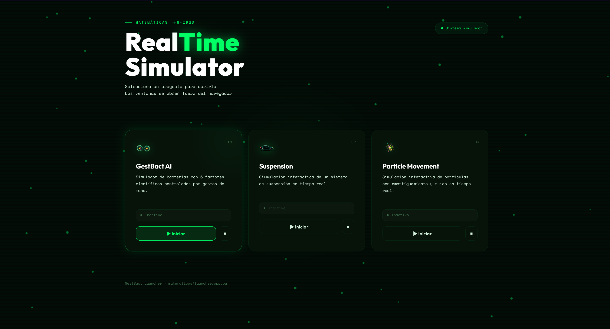
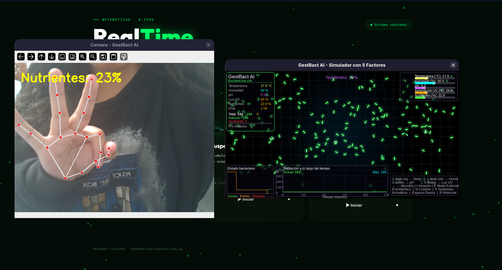
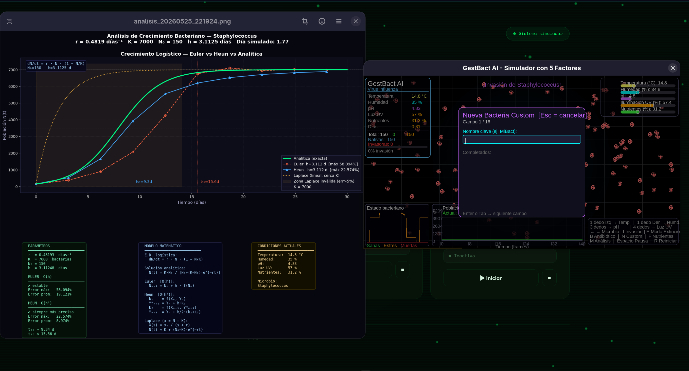

# 🚗 🦠 ✨ Simulaciones Numéricas Interactivas

> Tres simulaciones desarrolladas en Python para el curso de **Matemáticas para Ingeniería II**.  
> Métodos numéricos (Euler, Heun, Laplace) aplicados a sistemas físicos reales.



---

## ¿Qué hay dentro?

| # | Proyecto | Qué simula | Control |
|---|---|---|---|
| 1 | 🚗 **Suspensión de automóvil** | Sistema masa-resorte-amortiguador | Sliders de parámetros |
| 2 | 🦠 **GestBact AI** | Crecimiento bacteriano + invasión | Gestos de mano (webcam) |
| 3 | ✨ **Simulación de partículas** | Partículas con física + audio | Micrófono en tiempo real |

---

## 🚗 Proyecto 1 — Suspensión de automóvil

Modela la ecuación diferencial de un sistema masa-resorte-amortiguador:

```
m·x'' + b·x' + k·x = 0
```

El sistema se discretiza con Euler para calcular posición y velocidad en cada instante.
Varía `m`, `k` y `b` en tiempo real y observa cómo responde la suspensión.

**Analogías reales:**
- Sistema masa-amortiguador sin resorte: `m·x'' + b·x' = 0`
- Dispersión de contaminantes en aire con ventilación constante (decaimiento exponencial)

---

## 🦠 Proyecto 2 — GestBact AI

Simulación de poblaciones bacterianas controlada con gestos de mano via webcam.

### Arquitectura — 7 módulos

```
main.py          ← orquestador · game loop 60 FPS · física · renderizado
├── simulation.py   partículas, colisiones, crecimiento logístico, invasión
├── microbes.py     base de datos de microbios, cálculo de tasa r, LV params
├── gestures.py     cámara + MediaPipe · clasifica gestos · modula 5 factores
├── ui.py           sliders, HUD, PopulationGraph, StressGraph, InvasionGraph
├── analysis.py     PNG con Euler vs Heun vs Laplace + Lotka-Volterra (hilo daemon)
└── config.py       constantes globales: FPS, K, colores, umbrales
```

### Modelo matemático

**Crecimiento logístico (1 especie)**

```
dN/dt = r · N · (1 − N/K)

Solución analítica:  N(t) = K·N₀ / [N₀ + (K − N₀)·e^{−rt}]
Euler   O(h):        N_{n+1} = Nₙ + h·f(Nₙ)
Heun    O(h²):       N_{n+1} = Nₙ + h/2·(k₁ + k₂)
Laplace (cerca de K): X(s) = x₀/(s + r)  →  N ≈ K + (N₀−K)·e^{−rt}
```

**Invasión — Lotka-Volterra competitivo (2 especies)**

```
dN/dt = r₁·N·(1 − (N + α₁₂·M)/K₁)
dM/dt = r₂·M·(1 − (M + α₂₁·N)/K₂)
```

Coeficientes `α₁₂` y `α₂₁` calculados dinámicamente desde `r₁` y `r₂`.  
Estabilidad del equilibrio `(N*, M*)` via eigenvalores de la Jacobiana.

### Gestos disponibles

| Gesto | Acción |
|---|---|
| 1 dedo izq. | Temperatura |
| 1 dedo der. | Humedad |
| 3 dedos | pH |
| 4 dedos | Luz UV |
| `I` | Lanzar invasión |
| `B` | Antibiótico |
| `M` | Generar análisis PNG |
| `E` | Modo extinción |
| `F` | Reponer nutrientes |

### Análisis generado (`M`)

Presiona **M** durante la simulación para exportar un PNG con:

- Curva S logística — solución analítica vs Euler vs Heun vs Laplace
- Error relativo de cada método con anotación del máximo
- Dinámica Lotka-Volterra (si hay invasión activa)
- Tabla de parámetros, fórmulas y condiciones ambientales

Cada análisis se guarda como `data/analisis_YYYYMMDD_HHMMSS.png` — nunca sobreescribe.

---

## ✨ Proyecto 3 — Simulación de partículas con audio

Simulación de partículas con física en tiempo real donde el **sonido del micrófono
modula el comportamiento del sistema**.

### Arquitectura — 8 módulos

```
main.py           ← orquestador · loop de simulación · física · gestos · renderizado
├── particles.py     estado global de partículas (posición, velocidad, color, trayectoria)
├── audio.py         captura de micrófono con sounddevice · amplitud RMS suavizada
├── camera.py        inicialización de webcam con OpenCV en hilo paralelo
├── hand_tracker.py  detección de 21 landmarks con MediaPipe Hands
├── graphs.py        gráficas en tiempo real sobre canvas OpenCV (estilo dark)
├── splash.py        pantalla de carga animada mientras se inicializan módulos
└── analysis.py      reporte final PNG con matplotlib: curvas, métricas y modelo
```

### Detección de gestos

MediaPipe Hands detecta **21 landmarks** en coordenadas normalizadas `[0, 1]`.  
Un dedo se considera extendido si la punta supera la articulación base en más de `0.02` unidades.  
Historial de **8 frames** para suavizar la detección y eliminar falsos positivos.

### Audio reactivo

`sounddevice` captura el micrófono en tiempo real. La amplitud **RMS suavizada**
modula la tasa de crecimiento del sistema — hablar o hacer ruido cerca del micrófono
altera visiblemente la simulación.

### Arranque en paralelo

`camera.py`, `hand_tracker.py` y `audio.py` se inicializan en **hilos paralelos**
mientras `splash.py` muestra una pantalla de carga animada con chips de estado por módulo,
reduciendo el tiempo de arranque percibido.

---

## Instalación

```bash
git clone https://github.com/EsmeMP/Modelado-Simulacion_Sistemas_Dinamicos.git
cd Modelado-Simulacion_Sistemas_Dinamicos
pip install pygame numpy opencv-python mediapipe matplotlib sounddevice
```

**Proyecto 1:**
```bash
cd suspension
python main.py
```

**Proyecto 2:**
```bash
cd gestbact
python main.py
```

**Proyecto 3:**
```bash
cd particulas
python main.py
```

> Requiere Python 3.9+, webcam y micrófono.

---

## Imágenes




---

## Stack

`Python` · `Pygame` · `OpenCV` · `MediaPipe` · `Matplotlib` · `NumPy` · `sounddevice`

---

*Reporte Técnico · Ingeniería de Software 2026*